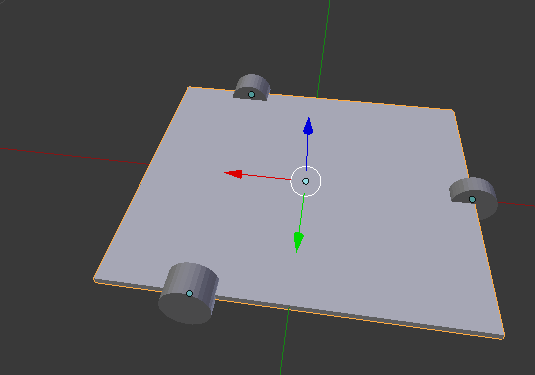
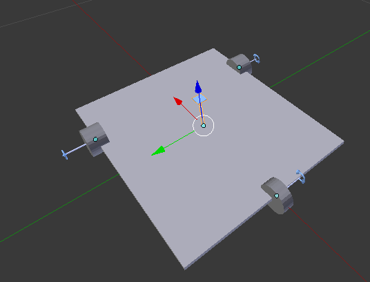

#安装blender

1, 官网下载

2, 添加源:
    $ sudo add-apt-repository  ppa:thomas-schiex/blender
    $ sudo apt update && sudo apt install blender -y

### 常用快捷键

    Shift+A 添加物体
    Shift+S 吸附, 设置游标或选中项的吸附关系
    
    Alt+D 复制物体, 有关联的
    Shift+D 复制物体, 全新的

    Ctrl+鼠标中键，在面板上拖动，面板缩放
    Ctrl+鼠标左键，拖动视口上的三根横线，选择多个物体
    Shift+鼠标中键, 拖动视口

    Ctrl+A
    应用"位移": 把自身坐标系原点设置到(0,0,0)的位置上
    应用"旋转": 把旋转设置为(0°,0°,0°)
    应用"比例": 把比例设置为(1,1,1),原来的比例转换为尺寸变化

    Ctrl+J 把多个物体合并成一个

    N 显示Properties特性栏

    Z 进入线条模式(透明, 只有线框)

    A 取消选中, 全选

    X 删除

    Tab 物体模式与编辑模式转换

    Space 功能搜索

# Blender技巧

### 原点设置
    Shift-Ctrl-Alt-C 或是 侧边工具，可以设置原点，
    比如几何中心到原点，原点到游标，两次操作可以交换几何中心和原点

### "变换参照坐标系"按钮
    可把全局坐标系设置为自身坐标系

### 由Ctrl+J合并成的单个对象分离成多个对象
        进入编辑模式, B-->选中需要拆分的物体(注意选择的物体可能只是几个面, 旋转, B, 继续选中其它部分), P-->选择并确定

### 调节视野显示范围
    N 属性面板, "视图"选项卡中, 设置可视范围, 即可..

### 选择面上的中心作为原点
    选择物体, Tab键切换到编辑模式, 选择面, Shift F, 游标到选中项, Shift-Ctrl-Alt-C, 原点到3D游标, OK了

### urdf插件:
    1, Create Link(s)                   ---> basic_link
        树体视图中: 自定义属性:
            link/name:base_link
            modelname:car

    2, Create Inertial Object(s)        ---> 创建一个惯性体, 表示urdf中的visual type

linuxcnc

## blender设置中文
    Ubuntu18默认没有中文字体，需要手动安装字体，并设置该字体，
    网上搜索一个中文字体，如"方正仿宋"，下载
    解压后,会有一个ttf字体文件
    cp ttf文件 /usr/share/fonts
    blender重选择这一字体文件就可以显示中文了
    ps: https://jingyan.baidu.com/article/14bd256e9d3551bb6d26120d.html            

# phobos插件, 制作urdf模型

### 先制作一个机器人底盘模型

注意: 机器人前进的方向是自身坐标系的x轴正方向

### 下面制作phobos模型
1. "Create Link(s)", 创建3个link, link相当于关节或是运动轴, link的形状可以反映出运动方向

2. 分别设置3个link的joint属性, 先选中link, 再点击"Define joint(s)", 在左下角的操作项中即可设置joint信息, link/name,link/type,modelname等属性

3. 把所有物体的比例都执行, Ctrl+A(应用) --> "比例",,,(就是把比例的影响转换成真实尺寸, 并消掉比例)

4. 设置父子关系, 组装各个link,,, 每一个link下都包含一个实体模型, 这个实体模型与轴一起转动(这个实体模型应该相对于link的位移是0,0,0 旋转是0,0,0 ? 这里待验证,我是这样做的,结果正确,不过却几乎修改了原模型所有的位姿参数)
对于设置父子关系, 会改变参考系,那么比例设置比例的模型会错乱, 解决方法是:选择该物体, Ctrl+A(应用) --> "比例"(也就是说把当前的尺寸变成物体本身的尺寸, 比例变成了1,1,1) 见下图:
   

Blender未知问题集合:
1. 如何把多个物体一齐缩放
2. 两个对象相交的部位切出一个槽, 可以定义槽的宽度
3. 部分物体,线条化(Z的部分效果)
4. 在有子对象存在的情况下,如何缩放当前对象而不影响子对象
