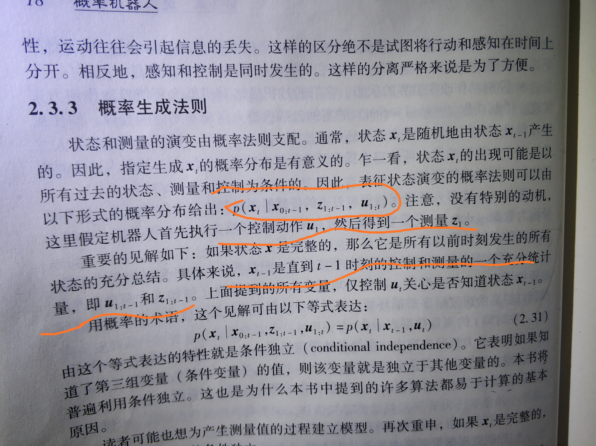
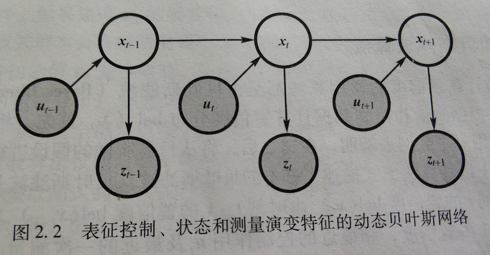

1, 编译csm:
sudo apt install build-essential cmake libgs-dev libcairo2-dev
git clone https://github.com/AndreaCensi/csm.git
mkdir csm/out -p
cd csm/out
cmake .. && make && sudo make install

2, odom_ws

sudo apt install libeigen3-dev

# 概率机器人学习

1. X, Z, U 三个表征: 
    1. 状态(会对未来产生影响的机器人及所有方面的因素, 比如: 附近人的行踪, 墙的位置, 机器人的速度、位姿)
    2. 测量(利用传感器获取环境状态的信息的过程, 比如摄像头采集到的照片信息, 激光测到的距离信息)
    3. 控制(携带状态改变的信息, 比如机器人控制的速度信息)
   
   疑问(1): 这里的"控制"怎么解释呢, 书中说里程计也是控制数据?我理解到的里程计信息是这样的: 在指定频率下, 一次间隔后, 编码值的变化, 引起机器人的位姿变化(差速控制原理), 再更新最新的位姿, 并发布最新的位姿到tf和里程计中
   这里的里程计信息很明显是状态统计吧, 由速度控制产生的结果被轮子驱动读取到并发布出去

    疑问(2): X, Z, U, 时序是怎样的?
    根据书中图片:
    

    我的理解:

    先抛开概率论, 我们想象一下过程, 初始环境: X0, Z0, U0, 在下一个时刻(时刻1)时, 有了一个控制U1(比如说速度指令), 此时, X和Z并没有立即改变(改变需要时间), 此时根据控制U1和前一时刻的测量Z0, 就能预测U1产生的结果X1(X1即为控制U1和测量Z1的充分统计量)(状态转移概率), 根据X0、Z0, U1同样也能预测Z1(测量概率)

    根据这里的想象， 再根据条件独立， 那么也可以解释： p(Xt | X0:t-1, Z1:t-1, U1:t)中的Z和U为什么从1开始